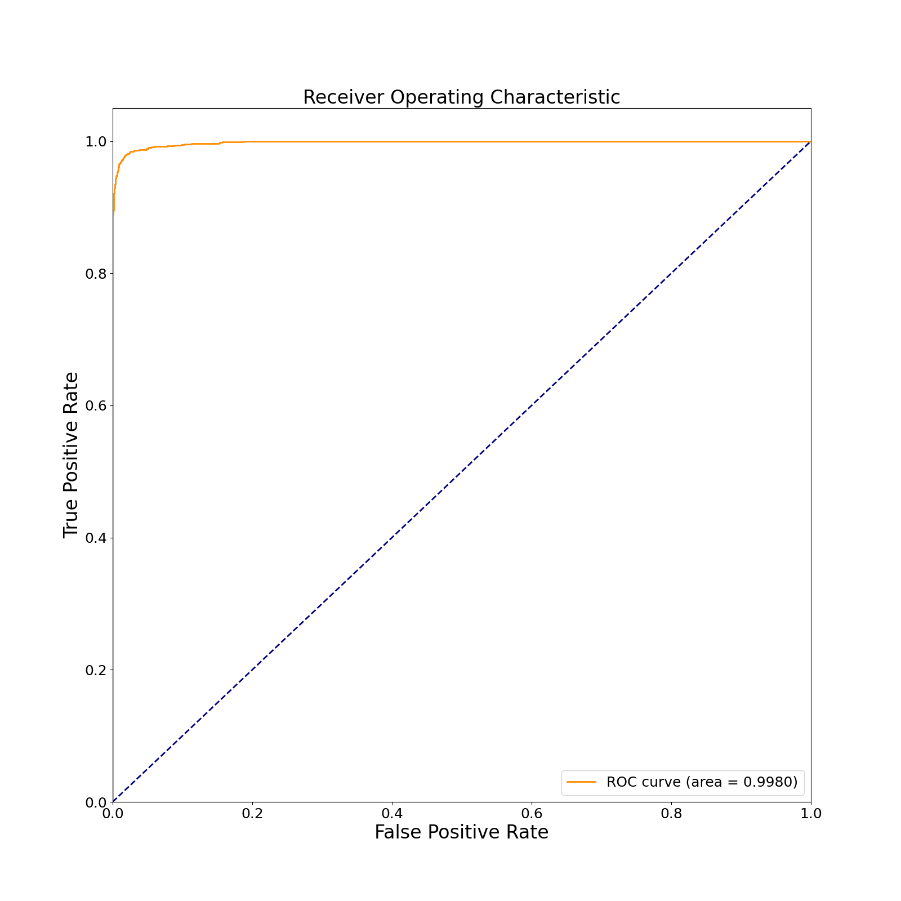

# Histograms of Oriented Gradients for Human Detection

This is a simple implementation of the CVPR2005 article [Histograms of Oriented Gradients for Human Detection (inria.fr)](https://hal.inria.fr/file/index/docid/548512/filename/hog_cvpr2005.pdf).

## Requirements

* Python==3.8
* numpy==1.23.2
* opencv==4.6.0
* scikit-learn==1.1.2
* matplotlib==3.5.3

## Data Preprocessing

You can download dataset from here [INRIADATA.zip](https://pan.baidu.com/s/1eSdlw7g)

We use images from "./INRIADATA/normalized_images/train" to train the SVM.  For positive samples, we crop the central (64, 128) area to compute the HOG vectors. For negative samples, we randomly crop 10 (64, 128) areas each sample to compute the HOG vectors. 
We use images from "./INRIADATA/original_images/test" to test. For positive samples, we crop the central (64, 128) area as testing samples. For negative samples, we randomly crop 10 (64, 128) areas each sample as testing samples.
(Noting that due to libpng version discrepancy, opencv cannot read the images directly. The solution is using PIL to load and re-save every image to a new directory. The function `pre(t)` in  `utils.py` provide such operation.)

## Usage

Reorganize the original data (you don't need to do re-save and crop operations) into following directories:

* "./data/train/pos"
* "./data/train/neg"
* "./data/test/pos"
* "./data/test/neg"

run `main.py`

## Results

**Accuracy: 0.9846, recall: 0.9396, precision: 0.9824**

ROC curve: 

